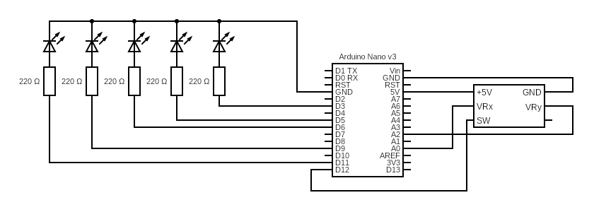

# Joystick

## Schéma

 

## Popis

Pozice joysticku se čte ve smyčce pomocí analogových vstupů a následně se pomocí PWM předává diodám na digitálních pinech. Obdobně pro diodu signalizující stisknutí.

## Poznámky

 - Ukazuje se, že člověk musí číst manuály. Protože ne všechny piny podporují na výstupu PWM: https://www.arduino.cc/reference/en/language/functions/analog-io/analogwrite/
