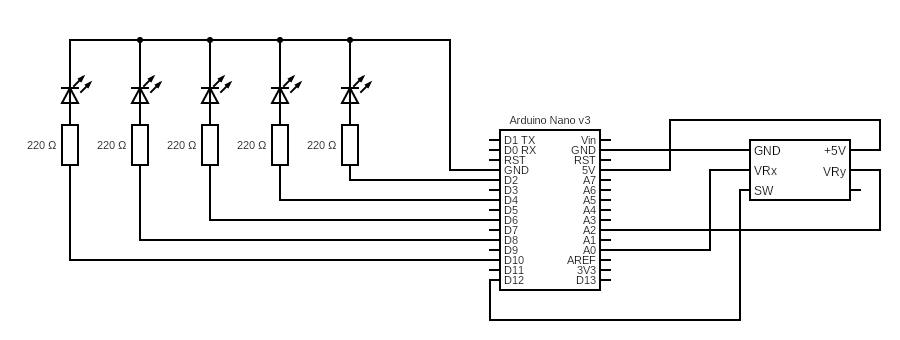

# Joystick

## Schéma

 

## Popis

Pozice joysticku se čte ve smyčce pomocí analogových vstupů a následně se pomocí PWM předává diodám na digitálních pinech. Obdobně pro diodu signalizující stisknutí.
